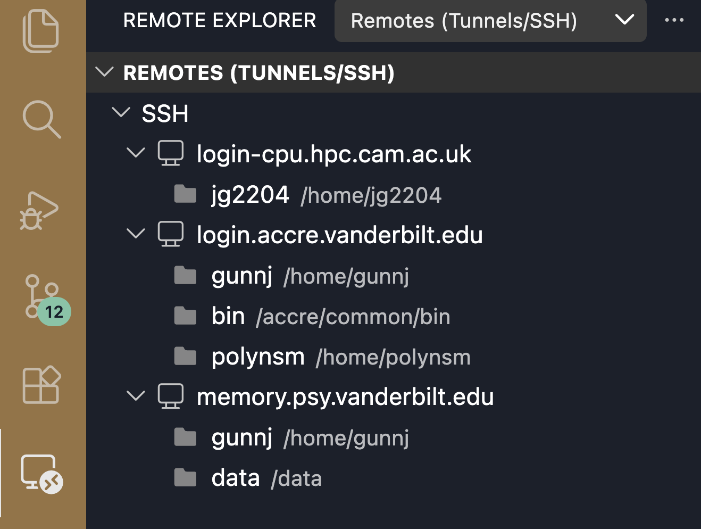

# Tools And Access

The recommended interface in this guide is VS Code Remote-SSH. It gives you a
remote file browser, editor, and terminal while still using normal SSH under the
hood.

The same commands also work from a plain SSH terminal.

## Tool Roles

The tools fit into a few jobs in the workflow.

Access tools get you onto CSD3. VS Code Remote-SSH gives you a remote editor
and terminal connected through SSH. Remote Explorer is the VS Code panel where
saved SSH targets appear. Plain `ssh` gives you the same CSD3 shell in a normal
terminal. Login-Web is the browser fallback when SSH tooling is not working.

When VS Code is connected to CSD3, its integrated terminal is a CSD3 terminal,
not a local Mac terminal.

File movement tools keep your local machine and CSD3 in sync. Git is for source
code and deliberate small project changes. `rsync` is for generated inputs,
large files, and outputs that should not be committed to Git.

Environment tools make your command runnable on CSD3. Python users might use
`uv` or Conda. Other workflows might use CSD3 modules, compiled software, R,
MATLAB, or field-specific tools.

Scheduling tools send work to compute nodes. Slurm is the scheduler, and
`sbatch` is the command that submits a job. Most of this guide is about
getting from "I have code" to "I can submit many clean units of work through
Slurm."

## Example Stack And Other Stacks

The main example uses a Python-heavy workflow: Python environment setup,
notebook execution, and helper scripts for notebook-shaped jobs.

The transferable part is not Python or notebooks. The transferable part is:

- connect to CSD3
- put code and inputs in a predictable project folder
- make one unit of work runnable from the command line
- submit that unit through Slurm
- scale it with arrays or repeated submissions
- monitor logs and sync outputs back

Other workflows can use the same shape with a different command layer:

- R scripts run with `Rscript`
- MATLAB scripts or functions submitted through Slurm
- shell scripts
- compiled programs
- software loaded through CSD3 modules
- workflow-specific tools for your field

CSD3 has specific guidance for
[R and Rscript](https://docs.hpc.cam.ac.uk/hpc/software-packages/r.html),
[MATLAB](https://docs.hpc.cam.ac.uk/hpc/software-packages/matlab.html),
[modules](https://docs.hpc.cam.ac.uk/hpc/user-guide/modules.html), and
[Python](https://docs.hpc.cam.ac.uk/hpc/software-tools/python.html).

## Local Machine: SSH Config

Add a named host on your local machine:

```sshconfig
Host csd3-login
  HostName login-cpu.hpc.cam.ac.uk
  User <your-crsid-or-username>
```

Check plain SSH first:

```bash
ssh csd3-login
```

If plain SSH cannot connect, fix that before debugging VS Code.

## Local Machine: VS Code Remote-SSH

In VS Code:

1. Install the Remote - SSH extension.
2. Open Remote Explorer.
3. Choose `csd3-login`.
4. Complete MFA if prompted.
5. Open the remote project folder, usually under `~/workspace/`.
6. Use the integrated terminal for CSD3 commands.

Remote Explorer is where configured SSH targets appear:



Commands labeled "CSD3" in this guide run in that remote terminal.

## Fallback: Login-Web

Use Login-Web when SSH or VS Code is unavailable. It gives shell access, so the
CSD3 commands in this guide still apply.
